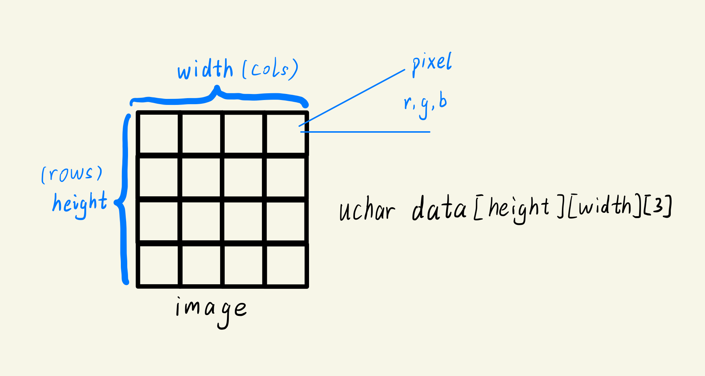

# bicubic-image-resize

使用双三次插值法对图像进行缩放。


## 构建与编译

以ubuntu为例

**依赖安装**

构建依赖
- build-essential
- cmake

在ubuntu下可以使用apt包管理器进行安装
```shell
$ sudo apt-get install build-essential cmake
```

**使用cmake进行构建**
在此目录下简历build目录并使用cmake进行构建与编译
```shell
$ mkdir build
$ cd build
$ cmake ..
$ make
```
## 使用与说明


第一个参数传入图像路径，会在图像的同目录下生成一张放大5倍的图像

```shell
./resize $IMAGE_PATH
```


功能类似于如下python伪代码
```python
from PIL import Image
image = Image.open($IMAGE_PATH)
resize_image = image.resize(5 * image.width, 5 * image.height)
image.save($RESIZE_IMAGE_PATH)

```


## 结构

- `resize.hpp` 图像缩放处理
- `image.hpp` 读写封装
- `utils.hpp` 辅助类
- `stb/` stb图像读写库

## 任务说明

你需要使用你所了解的各种方法优化代码，提高其性能，使得图像缩放消耗时间尽可能短。代码已包含计时功能。

更具体地说，在不改变计时区域与整个计算任务的情况下，你应当让计时器打印出的时间尽可能地短。
### 算法介绍

使用双三次插值法(BiCubic)对图像进行缩放，原理为：对于缩放后图像中的每一个像素点，找到其在原图中对应位置上最近的4x4像素网格，使用此网格进行插值运算得到该像素点的RGB。详见`resize.hpp`

关于双三次插值法进行缩放的原理，这里不进行展开，可以不关注。

### 输入输出

使用stb图像库进行处理，可以不关注。

读入图片后，得到3通道像素矩阵，即每个像素点的RGB排列在一起，各占据一个字节。

图像在内存中的排布如图


### 计时

读写不计入程序总时间。计时部分仅有`resize.hpp`中的`ResizeImage`函数，也仅需要优化此部分。

### 编译与构建

baseline默认编译优化等级为O3，应当在此基础上进行优化。

可以自己重新编写构建脚本，但编译优化等级应该设置为O3。

### 测试

在`images/`目录下给出了若干图片用于测试与计时。最终提交时，也会使用此目录下的图片进行评测程序性能。

注意：要求优化后的程序能够正确缩放图片。虽然不要求用diff test进行评测，但是起码保证图片缩放的效果比较好。建议不要改动总的计算逻辑。


## 参考

如果你不知道如何上手，可以从以下几个方面考虑
- 尝试更优秀的算法
- 合并计算步骤，消除冗余计算
- 调整访存结构，增大空间局部性
- 利用处理器的多个核心进行计算
- 使用向量计算指令

更多有关高性能计算的学习方向与资料，可翻阅[七边形HPC-roadmap](https://heptagonhust.github.io/HPC-roadmap/)

## 提交方式

你应当fork此代码仓库，并以此为基础进行开发。

你需要在11月30日23:59之前将自己的开发仓库以pull request的方式提交到本仓库下。
